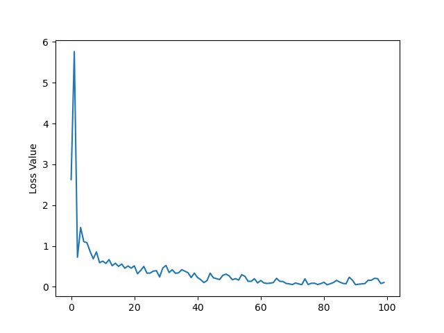

# UVU_image_recog

This repository is a small Convolutional Neural Network written in Pytorch with the goal of classifying whether or not an image has a metal artifact in it. The images and the file to the model itself has been removed due to github upload requirements, so images and model can be sent upon request.

With a very small dataset of unstandardized images from the internet fitting the classification specification described above the model was still successful and completing its goal. During 100 epochs of training the loss function minimized shown below:

This model can be easily modified to become larger and more detailed and can be trained for much longer. The training runtime took all of 10 minutes.

## Furthering this Model
Gaining access to a data set of images with metal artificats in them would be the most difficult part of polishing this model. Images without metal seem to be [very easy to come across](https://www.cancerimagingarchive.net/). However without a reliable set of metal artifact images the model would have a hard time learning the difference between the two classifications.
